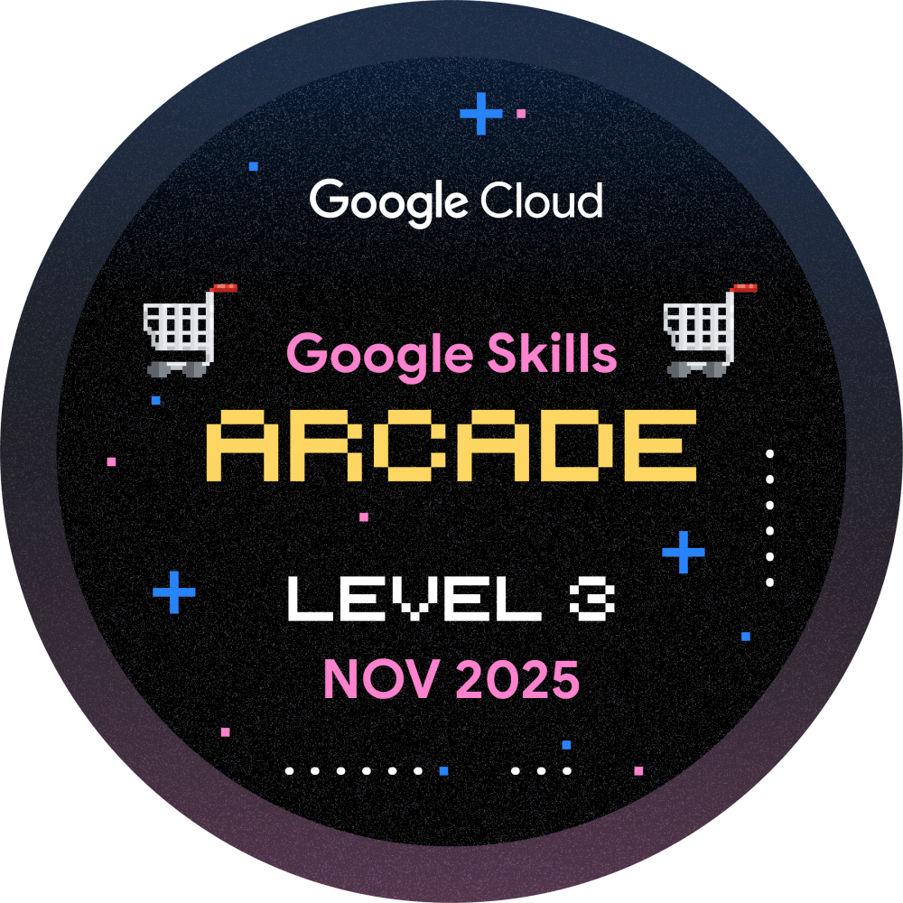

# 👋 Hey, I’m Pramit Acharjya

I'm a self-taught AI & software developer with a passion for building **offline LLMs**, **multi-agent AI tools**, and **creative automation systems**.  
Currently studying in (Maulana Abdul Kalam Azad University of Technology) and pursuing online degrees in **Data Science & AI** from **IIT Guwahati**.

> I believe in shipping cool things that work and I’ve already built over **15 full-stack projects** ranging from AI chatbots to YouTube automation systems.

---

## 🚀 Featured Projects

| Project | Description |
|--------|-------------|
| 🧠 [AI Desktop Chatbot](https://github.com/KaisoX24/Desktop-Ai-chatbot) | Offline chatbot with GUI using LLaMA 3.2 + LangChain + Ollama |
| 🌐 [Gemini-Based Multi-AI Site](https://github.com/KaisoX24/GEMINI-BASED-AI) | One-stop interface for PDF, Image, and Chat AI agents |
| 📺 [YouTube Playlist Collector](https://github.com/KaisoX24/YouTube-Video-Collector) | Fetch and sort thousands of YouTube videos from multiple channels |
| 🎬 [YouTube Script Generator](https://github.com/KaisoX24/Youtube-Video-Script-Generator) | 7-section story generator using Grog + LLaMA, with context memory |
| 🧮 [Railway Management System](https://github.com/KaisoX24/Railway-Management-System) | Full DBMS backend with CRUD operations, CLI menus |
| 🕶️ [LLaMA from the Hood](https://github.com/KaisoX24/Llama) | A roleplay-heavy LLaMA that speaks in street slang and hood style 😎 |

---

## 🧠 Currently Building

- **Void Archives** — A meta-LLM that mimics the behavior of other LLMs  
- Experimenting with **agent chaining**, **prompt control**, and **persona emulation**

---

## 🌐 Socials:

---

# 💻 Tech Stack:
                       

---

# 📊 GitHub Stats:
 
 

---

## 🏆 GitHub Trophies

---
## 🏆 Arcade Badges

---
## 🏆 Skill Badges

### ✍️ Random Dev Quote

---

